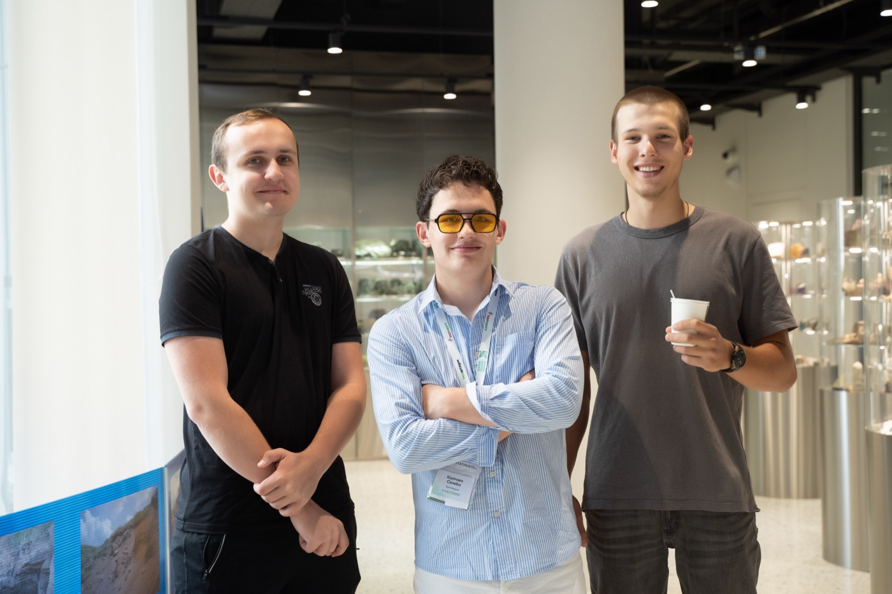
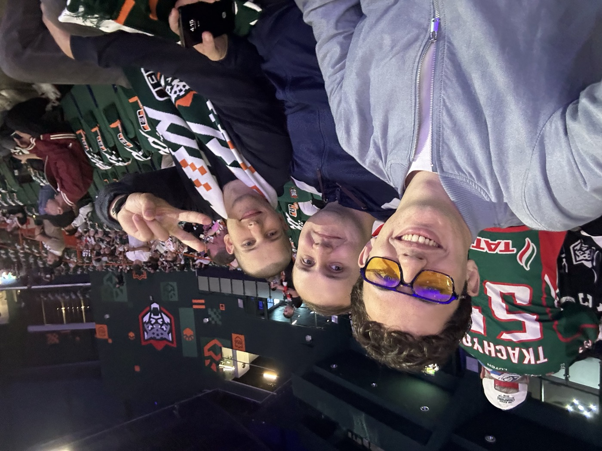
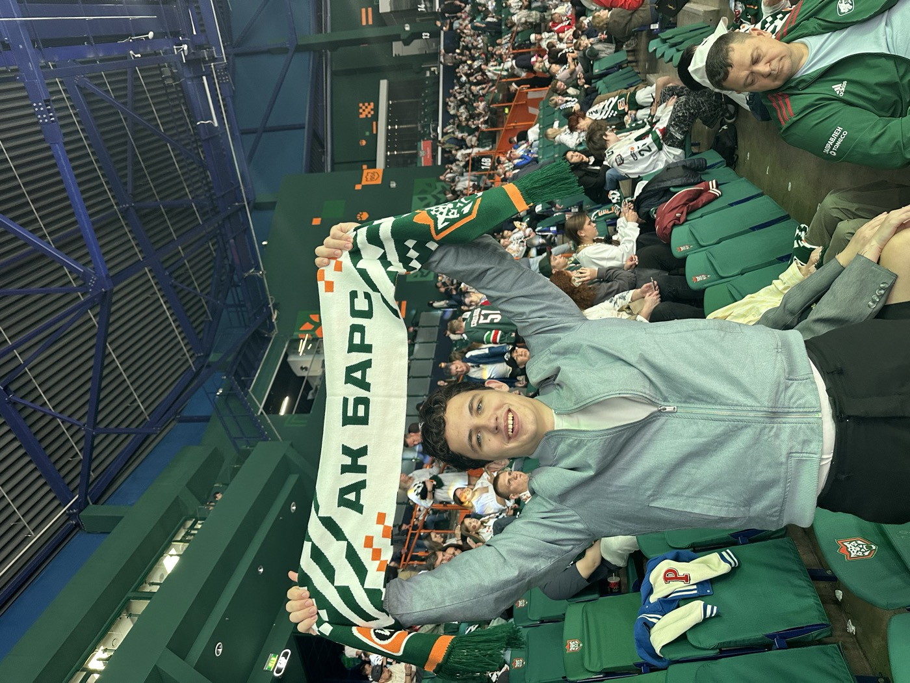
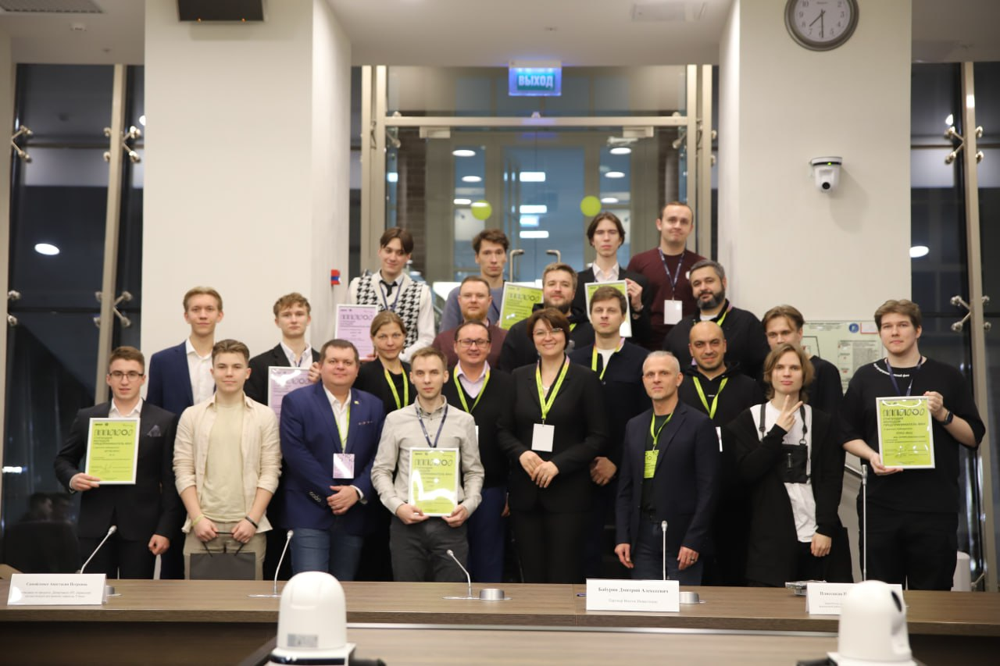
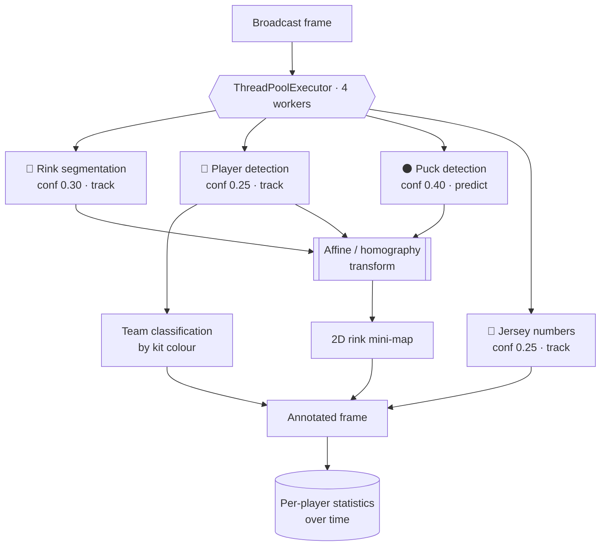

<div align="center">

# 🏒 Hockey AI Analytics

**Real-time hockey match analytics from video — four YOLO models running in parallel to detect players, the puck, the rink and jersey numbers, then projecting everything onto a live 2D mini-map of the ice.**

[](https://www.python.org/)
[](https://docs.ultralytics.com/)
[](https://opencv.org/)
[](https://roboflow.com/)
[](LICENSE)

[](#-how-this-project-happened)


<sub>A real KHL match being analysed: players detected and tracked, jersey numbers read, teams separated — and every player projected onto the 2D mini-map in the corner.</sub>

</div>

---

> 📅 **Project timeline.** Built in **August–October 2024** — it started at the hackathon, then ran for roughly another month and a half of work with the club. The project is **no longer under active development**; this repository is an archive of where it got to.

## 📋 Contents

[The problem](#-the-problem) · [The idea](#-the-idea) · [Story](#-how-this-project-happened) · [What it measures](#-what-it-measures) · [Architecture](#️-architecture) · [The mini-map](#️-the-mini-map-the-heart-of-the-system) · [Models & training](#-models--training) · [Data](#️-data-collection--labelling) · [Cameras](#-camera-setup) · [Market](#-why-this-matters) · [Quick start](#-quick-start) · [Weights](#-model-weights) · [Roadmap](#️-roadmap)

---

## 🎯 The problem

Every professional hockey club runs on data: how long each player was on the ice, how far they skated, how many passes they completed, how many faceoffs they won, where they spend their shifts. Coaches use it to build tactics; scouts use it to evaluate players.

The catch is **how that data gets collected**. In Russia it is still overwhelmingly **manual** — an analyst sits with the tape and tags events by hand. That means:

- **It's expensive.** Manual tagging costs real money per match, which is exactly what smaller clubs don't have.
- **It's slow.** Reports arrive *after* the game — often much later — so they can't inform decisions *during* it.
- **It's error-prone.** Attention drifts; humans miscount.
- **It doesn't scale.** There are far too many matches in a season to tag them all, so most games simply never get analysed.
- **It's limited.** Some metrics — total distance skated, precise ice time across every shift, full movement heat maps — are effectively impossible to collect by hand at all.

The result: top KHL clubs buy expensive analytics, and everyone below them — youth leagues, regional clubs, federations — largely goes without.

## 💡 The idea

Do it with computer vision instead. Point the system at match video and let it watch the game the way an analyst would, but frame by frame and without ever getting tired:

1. **Find everything on the ice** — every player, the referees, the goals, the puck, and the rink itself.
2. **Know who is who** — read the numbers on the jerseys and separate the two teams by kit colour.
3. **Convert the picture into real geometry** — take the broadcast camera view and transform it into a top-down map of the rink, so a player is no longer "some pixels in a frame" but *a coordinate on the ice*.
4. **Turn coordinates into statistics** — once you have per-player positions over time, distance, speed, ice time, heat maps and tactical shape all fall out of the data.

Step 3 is the one that makes the rest possible, and it's where most of the engineering went.

## 🏆 How this project happened

It started at a **hackathon in Almetyevsk**, run by Tatneft, where one of the tasks was to build a system for analysing hockey matches. While working on it we met representatives of **HC Ak Bars**. They told us something that reframed the whole problem: *no system in Russia collects match data automatically in real time*. Everything is manual, it takes far too long, and clubs genuinely want the technology to exist.

<div align="center">


</div>

After the hackathon we **kept building it for Ak Bars, at their request** — roughly **another month and a half** of work: collecting and labelling far more data, retraining every model, and building out the mini-map projection that turns detections into real ice coordinates.

We travelled to **Kazan** to work on it on-site with the club, and were invited to matches at **Ak Bars Arena** — which turned out to matter a lot, because watching how analysts actually work during a live game changed what we thought the product needed to be.

<div align="center">

<br/>
<sub>The hackathon in Almetyevsk · with HC Ak Bars · at Ak Bars Arena in Kazan</sub>
</div>

Later the project won the **"Young Entrepreneur"** competition at the **HSE Faculty of Computer Science**.

<div align="center">

<br/>
<sub>🏆 The "Young Entrepreneur" competition at the HSE Faculty of Computer Science</sub>
</div>

## ✨ What it measures

| Metric | How it's derived |
|---|---|
| ⏱️ **Ice time** | Per-player presence tracked continuously across shifts |
| 📏 **Distance covered** | Summed movement in real rink coordinates (not pixels) |
| 🎯 **Passes** | Puck possession transitions between tracked players |
| 🥍 **Faceoffs won** | Puck outcome after a faceoff situation |
| 🗺️ **Heat maps** | Density of a player's positions over the match |
| ⚡ **Intensity** | Speed, shift frequency, actions per unit of time |
| 🧭 **Tactical shape** | Team formation and spacing at any moment |
| 🔬 **Player comparison** | Any of the above, player-vs-player, per match or per season |

## 🏗️ Architecture

The system is deliberately built as **independent single-purpose models fused at the end**, rather than one monolithic network. Each task (rink, players, puck, numbers) has different failure modes, different optimal image sizes and different confidence thresholds — keeping them separate means each can be trained, tuned and swapped on its own.

On every frame, all four models run **concurrently** in a thread pool:



Because inference dominates the per-frame cost, running the four models in parallel rather than sequentially is what keeps the pipeline anywhere near real time.

### The modules

| Module | Task | Why it's hard |
|---|---|---|
| [`field_detection/`](code/field_detection) | Segments the rink and its markings | Supplies the reference geometry everything else depends on — errors here corrupt every coordinate downstream |
| [`player_detection/`](code/player_detection) | Detects and **tracks** players | Players occlude each other constantly, cluster at the boards, and leave/enter frame; trained at **900 px** input (vs 640 elsewhere) because players are small in a wide shot |
| [`puck_detection/`](code/puck_detection) | Detects the puck | The hardest target by far — a few pixels wide, moving at extreme speed, often motion-blurred or fully occluded. Runs at the **highest confidence threshold (0.40)** to suppress false positives |
| [`jersey_recognition/`](code/jersey_recognition) | Reads the numbers on jerseys | Numbers are only legible when a player faces the right way; needs side camera angles to work reliably |
| [`player_classification/`](code/player_classification) | Splits players into teams by kit colour | Must be robust to lighting, motion blur and referees' striped kit |
| [`mini_map/`](code/mini_map) | Projects detections into rink coordinates | See below |

## 🗺️ The mini-map: the heart of the system

Detections alone are not analytics. A bounding box says *"a player is here in the image"* — but the image is a perspective view from a camera at an arbitrary angle, so pixel distance means nothing: two players ten pixels apart near the far boards may be metres further apart than two players ten pixels apart in the foreground.

To get real numbers we need to move from **camera space** to **rink space**:

1. The **rink-segmentation model** identifies the ice and its markings — lines, circles, zones — which are at known, fixed positions on a regulation rink.
2. Those act as **reference points** between what the camera sees and a canonical top-down rink template.
3. From that correspondence we compute an **affine / homography transform** mapping any image point to a point on the flat rink.
4. Every detected player and the puck is pushed through that transform, producing **true ice coordinates**.

Once you have coordinates over time, everything else is arithmetic: distance is the sum of displacements, speed is its derivative, heat maps are a 2-D histogram, and tactical shape is the geometry of the team's points at an instant.

The mini-map rendered in the corner of the demo is the *visualisation* of this transform — but its real purpose is to be the data layer the statistics are computed from.

> Development of the transform lives in [`code/mini_map/affine_transformation.ipynb`](code/mini_map/affine_transformation.ipynb), with the applied pipeline in [`inference.ipynb`](code/mini_map/inference.ipynb).

## 🧠 Models & training

No off-the-shelf hockey models existed, so **every model here was trained by us from scratch** on data we collected and labelled ourselves.

Training is **config-driven**: a shared `BaseConfig` holds the defaults, each task subclasses it with its own overrides, and a single `CFG` switchboard decides which models to (re)train in a run.

```python
# code/utils/base_config.py
class BaseConfig:
    model: str = "yolov8s"
    batch_size: int = 8
    image_size: int = 640
    epochs: int = 50
    dataset_workspace: str = "fastdeploy"
    ...

# code/player_detection/config.py
class PlayerDetectionCFG(BaseConfig):
    image_size = 900      # players are small in a wide rink shot
    batch_size = 24
```

```python
# code/config/config.py — pick what to train this run
class CFG:
    players_detection = False
    puck_detection    = True
    field_detection   = False
    jersey_recognition = False
```

Running [`code/train.py`](code/train.py) then, for each enabled task:

1. **Fetches the dataset from Roboflow** by workspace / project / version, in YOLOv8 format — skipping the download if the correct version is already on disk
2. **Rewrites `data.yaml`** to absolute paths and strips stray keys, so training is reproducible regardless of where the repo lives
3. **Trains YOLOv8** with augmentations tuned for broadcast footage:

   | Parameter | Value | Why |
   |---|---|---|
   | `degrees` | 3.0 | Slight camera roll between arenas |
   | `shear` | 3.0 | Perspective variation across camera positions |
   | `perspective` | 0.0001 | Gentle — the rink geometry must stay learnable |
   | `mixup` | 0.02 | Light regularisation; too much destroys small objects like the puck |
   | `epochs` | 50 | Per task |

4. **Promotes the best checkpoint** automatically to `weights/{task_name}.pt`, so inference always picks up the newest model

A **game-stage classifier** (detecting the phase of play) is scaffolded in the training switchboard as the next model to add.

## 🗂️ Data collection & labelling

This was the single biggest time investment in the project.

- We gathered footage from a **large number of Russian hockey matches**, across different arenas, lighting conditions and camera setups — variety here is what makes the models generalise instead of overfitting one rink.
- Videos were **split into frames**, then sampled so the training set wasn't thousands of near-identical images.
- Everything was **labelled by hand in [Roboflow](https://roboflow.com/)**: players, referees, goals, the puck, rink geometry and jersey numbers — each as its own dataset with its own class scheme, because each model has a different job.
- Datasets are **versioned in Roboflow**, and the training code pins a specific version per task, so a training run is always reproducible.

**Datasets:**

| Dataset | Used for |
|---|---|
| [Rink & geometry](https://app.roboflow.com/pabeda/-8lcdz/5) | Field segmentation → the projection reference |
| [Players, referees & goals](https://app.roboflow.com/pabeda/players-referee-gates-hockey/10) | Player detection and tracking |
| [Game situations](https://app.roboflow.com/pabeda/hokey-fights/2) | Situation/event recognition |
| [Auxiliary set](https://app.roboflow.com/pabeda/-gm7sj/3) | Supporting task |

## 📷 Camera setup

The system runs on ordinary broadcast footage, but a dedicated arena install unlocks the full metric set:

- **Full — 6 cameras:** 2 overhead (positions and movement), 2 at the sides (jersey numbers, which need a face-on angle), 2 at the benches (shifts and ice time)
- **Minimum — 2 cameras** at the sides: fewer metrics and lower precision, but still a genuinely useful analysis

No specialised hardware beyond the cameras is needed — the processing runs on a standard GPU machine.

## 📊 Why this matters

Russian clubs largely rely on **InStat**, which is built around *manual* collection: reports come with a delay and the price puts it out of reach for smaller clubs. **Iceberg** promised an automated alternative years ago and left clubs disappointed. Foreign platforms (**Hudl**, **Catapult**) target other markets and are effectively unavailable.

That leaves a clear gap:

- **Youth leagues (MHL and below)** — small budgets, a huge number of matches, and a slower game that is genuinely *easier* to process reliably in real time
- **Hockey federations** — need systematic data across clubs to track player development at a national level

There are **100+ clubs** across the KHL, VHL and MHL alone, and automated match analysis is the direction the sport is moving worldwide.

## 🚀 Quick Start

```bash
git clone https://github.com/simeonkolchin/hockey-ai-analytics.git
cd hockey-ai-analytics

python -m venv .venv && source .venv/bin/activate
pip install -r requirements.txt
```

Download the trained weights into `weights/` (see [below](#-model-weights)), then annotate a video end-to-end:

```bash
python code/main.py
```

To retrain a model, set the flags in `code/config/config.py` and run:

```bash
export ROBOFLOW_API_KEY=your_key    # needed to pull datasets
python code/train.py
```

## ⚙️ Configuration

| Variable | Used by | Description |
|---|---|---|
| `ROBOFLOW_API_KEY` | `code/train.py` | Roboflow key used to download the versioned datasets |

## 📦 Model weights

The four trained models are published as a **[GitHub Release](https://github.com/simeonkolchin/hockey-ai-analytics/releases/tag/weights-v1)** (too large for git). Download them into `weights/`:

| Weight | Task | Size |
|---|---|---|
| `field_detection.pt` | Rink segmentation | ~52 MB |
| `player_detection.pt` | Player detection & tracking | ~22 MB |
| `puck_detection.pt` | Puck detection | ~50 MB |
| `jersey_detection.pt` | Jersey-number recognition | ~21 MB |

The **full-length demo video** is attached to the same release.

## 📁 Project structure

```
hockey-ai-analytics/
├── code/
│   ├── main.py                  # inference: 4 models in parallel → annotated video
│   ├── train.py                 # training orchestrator (switchboard-driven)
│   ├── config/                  # which models to train this run
│   ├── field_detection/         # per-task training configs
│   ├── player_detection/
│   ├── puck_detection/
│   ├── jersey_recognition/
│   ├── player_classification/   # team separation by kit colour
│   ├── mini_map/                # affine/homography → 2D rink projection
│   └── utils/                   # Roboflow download, data.yaml rewrite, YOLO training
├── weights/                     # trained models (from the Release)
└── docs/                        # demo and photos
```

## 🗺️ Roadmap

- [x] **Research & prototype** — event definitions, team separation, player & puck detection, tracking with speed, rink projection
- [ ] **MVP** — arena camera integration, testing on live matches, pilot deployments with clubs
- [ ] **Scale** — accuracy and throughput optimisation; recognise goals, blocks and substitutions
- [ ] **Productise** — analyst dashboard + API, integration with existing analytics platforms

## 👥 Authors

- [**Simeon Kolchin**](https://github.com/simeonkolchin)
- [**Dmitriy Kutsenko**](https://github.com/kdimon15)

## 📄 License

MIT © [Simeon Kolchin](https://github.com/simeonkolchin) & [Dmitriy Kutsenko](https://github.com/kdimon15)
